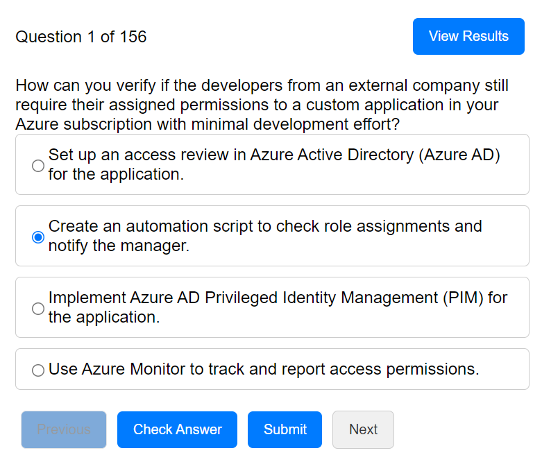
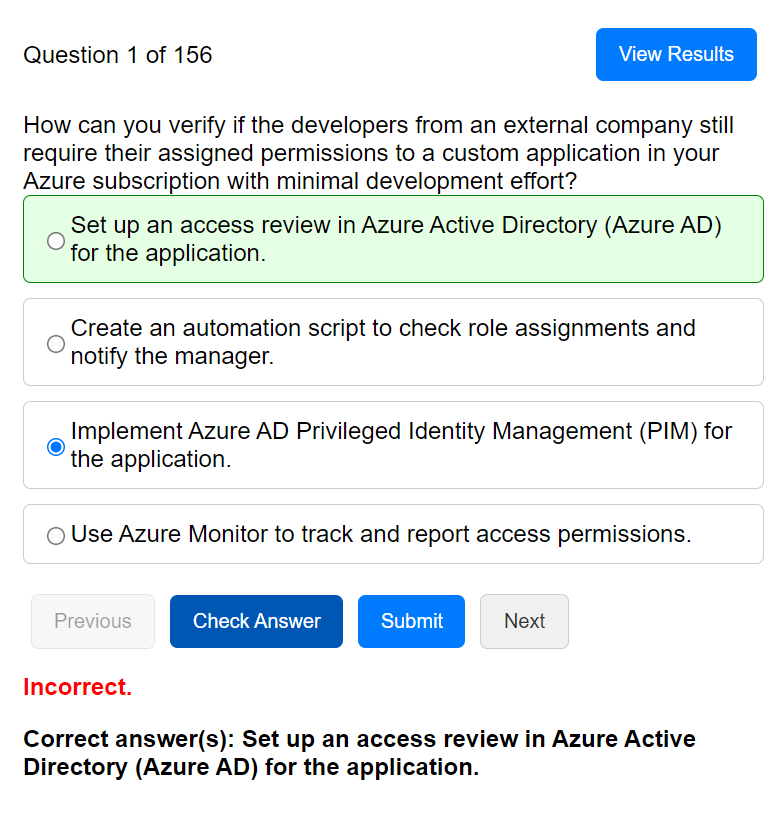
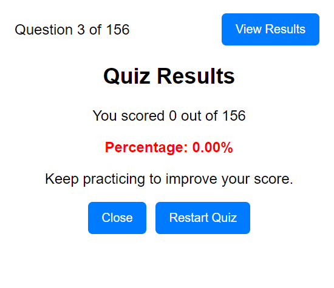

# Azure Study Test App

## Overview

View the demo site here: https://tinyurl.com/49yurvpw

This project is an Azure study test application designed to help users prepare for Azure certifications. The application consists of a front-end React application and a back-end Node.js/Express server with a MongoDB database. It allows users to answer quiz questions, track their scores, and view results.

## Technologies Used

### Front-End
- **React**: A JavaScript library for building user interfaces.
- **Axios**: A promise-based HTTP client for the browser and Node.js.
- **CSS**: Styling for the application.
- **TypeScript**: A statically typed superset of JavaScript.

### Back-End
- **Node.js**: A JavaScript runtime built on Chrome's V8 JavaScript engine.
- **Express**: A minimal and flexible Node.js web application framework.
- **MongoDB**: A NoSQL database for storing quiz questions and user data.
- **Mongoose**: An ODM (Object Data Modeling) library for MongoDB and Node.js.
- **PM2**: A production process manager for Node.js applications.
- **dotenv**: A zero-dependency module that loads environment variables from a .env file.
- **CORS**: Middleware to enable Cross-Origin Resource Sharing.

### Additional Tools
- **Git**: Version control system.
- **GitHub**: Code hosting platform for version control and collaboration.
- **DigitalOcean**: Cloud infrastructure provider for hosting the application.
- **OpenAI API**: Used for generating quiz questions.
- **Azure Static Web Apps**: Used for deploying the front-end React application.

## Features

- **Quiz Functionality**: Users can answer questions, receive feedback, and see their scores.
- **Persistence**: User scores and question progress are saved in local storage to persist through page refreshes.
- **Responsive Design**: Optimized for both desktop and mobile views.

View the demo site here: https://tinyurl.com/49yurvpw

## Installation and Setup

### Prerequisites

- Node.js and npm
- MongoDB
- PM2
- DigitalOcean Droplet (or any other server)
- Questions and Answers Data (please contact me if you need help organizing your QnA Database)

### Steps

1. **Clone the Repository**
    ```sh
    git clone git@github.com:gnwankpa/az-study-test-ts-react-back.git
    cd az-study-test-ts-react-back
    ```

2. **Install Dependencies**
    ```sh
    npm install
    ```

3. **Set Up Environment Variables**
    Create a `.env` file in the root directory with the following content:
    ```
    MCS_WP=<your-mongodb-uri>
    OPEN_AI_KEY=<your-openai-api-key>
    ```

4. **Start the Server with PM2**
    ```sh
    pm2 start src/index.ts --interpreter ts-node
    pm2 save
    pm2 startup
    ```

5. **Deploy Front-End**
    The front-end React application is deployed using Azure Static Web Apps. Follow the Azure documentation to set up and deploy your React application.

6. **Access the Application**
    Open your browser and go to `http://<your-domain>:<your-port>`

## Screenshots

### Main Test Page


### Quiz Answers and Explanation Page


### Results Page


## Conclusion

This project demonstrates the integration of various technologies to build a full-stack application. It showcases skills in React, Node.js, Express, MongoDB, and deployment on DigitalOcean and Azure. The app is designed to be scalable, maintainable, and user-friendly, making it a valuable tool for those preparing for Azure certifications.

View the demo site here: https://tinyurl.com/49yurvpw

## Contact

For any inquiries or further information, please contact me at ccnwankpa@gmail.com.